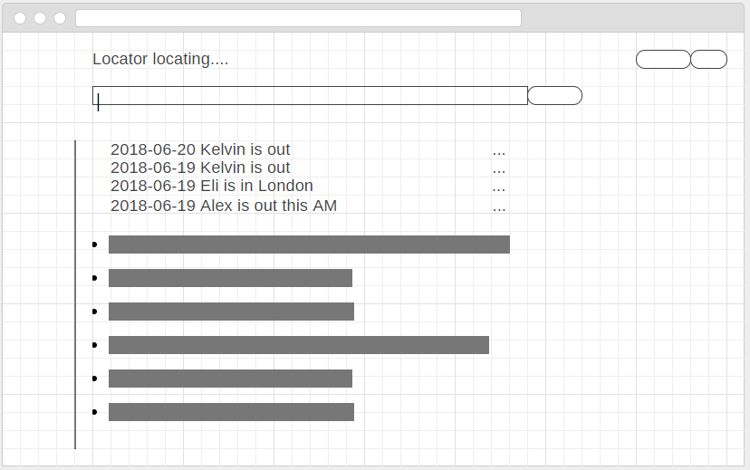
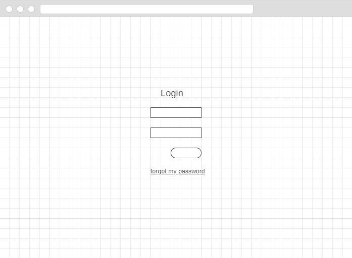
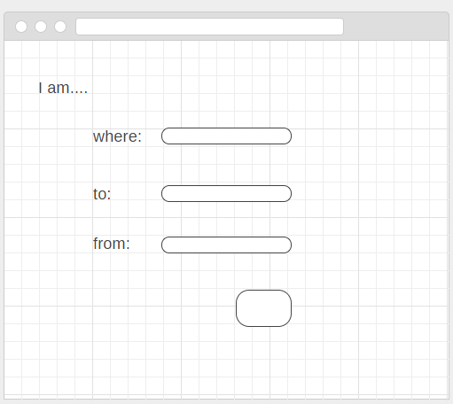

## locator design

### main app

[source](https://wireframe.cc/jzqjI9)

* Combo box for following fields:
  * who (default)
  * where (search)
  * I am ... (add a new element)
  * I'm actually not ..... (delete an existing element by id?) 

* Questions:
  * how do we want to handle delete of an item?
    * could be a different for the whole interaction, or on the bar 

* Items contain: 
  *  id: int
  *  who: person's name
  *  where: location
  *  when: time
  *  possibly an x element to delete?
  
### login page

### new event form

[source](https://wireframe.cc/nOFTKC)

* The where will be a populated drop down menu (they didn't have a good one on the wireframe site)
* group will be maintained in the database? 
  * alternately should we create a "profile" page to set user details and maintain them?
  
  